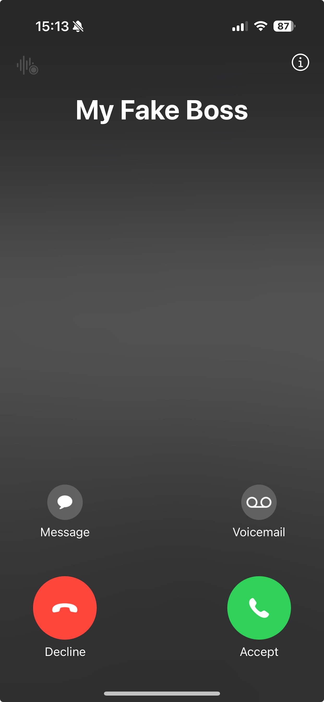

# Get Me Out of Here


## Project Overview

This project provides a way to escape awkward situations by simulating a call from a fake person. It consists of a backend API built on AWS infrastructure and a frontend iOS app. The app allows users to input their phone number and trigger an outbound call to get them out of an undesirable interaction.

---

## Backend

The backend is built using AWS services and Terraform for infrastructure as code. Below are key components:

### API Gateway
The API Gateway is set up to handle requests and integrates with Lambda for outbound call processing.

### Lambda Functions
1. **Lambda Authorizer**: Verifies API Key authenticity.
2. **Connect Outbound Lambda**: Handles the logic for initiating outbound calls.

### AWS Connect
Used to simulate the phone call. Configured with:
- Contact flows
- Queues
- Routing profiles
- Users

### CloudFront
Configured for the frontend and API distribution with proper caching and origin access control.

### Terraform Configuration
Key components include:
- `aws_route53_zone`: Sets up DNS records.
- `aws_cloudwatch_log_group`: Manages API Gateway logs.
- `aws_acm_certificate`: Ensures secure communication.
- `aws_secretsmanager_secret`: Stores sensitive API keys.
- `random_password`: Generates secure passwords for Connect users.

### Securing Secrets
Generate the API key using:

```bash
openssl rand -hex 32
```

Store the generated API key in AWS Secrets Manager and update `Secrets.plist` for the iOS app with:
- `API_KEY`
- `API_URL`

---

## Frontend (iOS App)


The iOS app is built using SwiftUI and integrates with the backend API Gateway. It features:

1. Input for user phone number with formatting and validation.
2. API call to trigger the backend.
3. User feedback on the status of the request.



## Setup Instructions

### Backend Setup
1. Populate `terraform.tfvars`:
   - `connect_users`: Map of users and their details.
   - `did_prefix`: Preferred DID prefix.
   - `domain`: Base domain for the website.
   - `environment`: Name of the environment (e.g., `get_me_out_of_here`).
   - `region`: AWS region.

### Frontend Setup
1. Add `API_KEY` and `API_URL` to `Secrets.plist`.
2. Configure the app to retrieve and use these values for secure communication with the backend.

### Secrets Management
Generate and securely store the API key:

```bash
openssl rand -hex 32
```

Add this value to:
- AWS Secrets Manager (`API_KEY` secret).
- `Secrets.plist` for the iOS app.

---

## Security Measures
- All sensitive data is stored in AWS Secrets Manager.
- The API is protected using a custom Lambda Authorizer.
- CloudFront enforces HTTPS communication.
